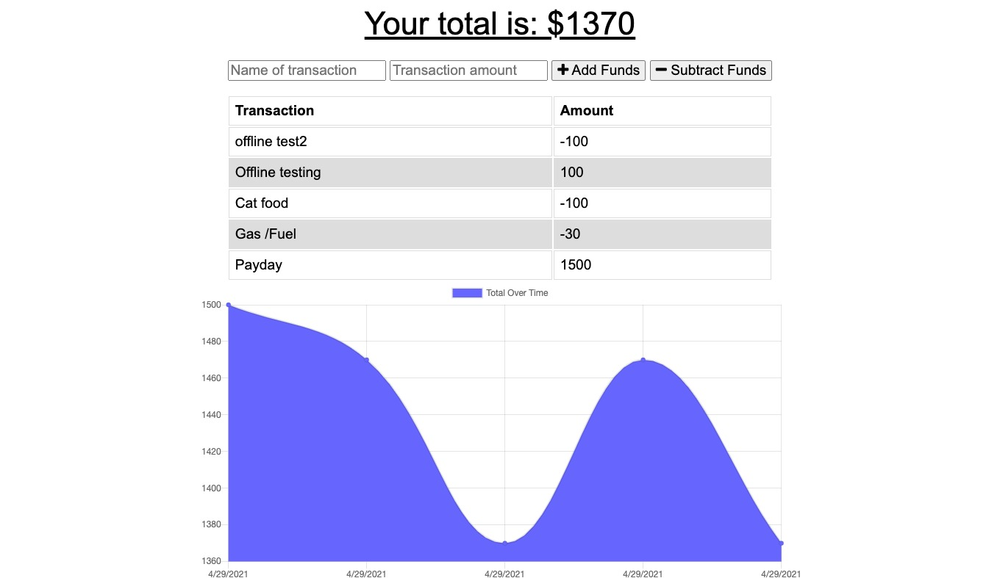

# PWA Budget
  
## Description
This is a budget app that has been created with PWA features, it can work online as well as offline, it uses IndexedDB to save offline transactions and service workers to cache static assets as well api calls
## Table of contents
- [Installation](#installation)
- [Usage](#usage)
- [License](#license)
- [Contribution Guidelines](#contribution)
- [Testing Instructions](#testing)
- [Questions](#questions)
## Mock Up

## Installation
No need to install, [link to app ](https://stormy-brook-33815.herokuapp.com/)
## Usage
You can insert yout transaction name and amount and press any of two buttons to save it as income or expense
## License
This project uses the [MIT](LICENSE) License 
## Contribution
You can create a pull request or contact me at my email or github account
## Testing
No testing has been implemented at this moment
## Questions
You can contact me at: 
jpecheverryp@gmail.com
and you can find me on github at:
jpecheverryp
